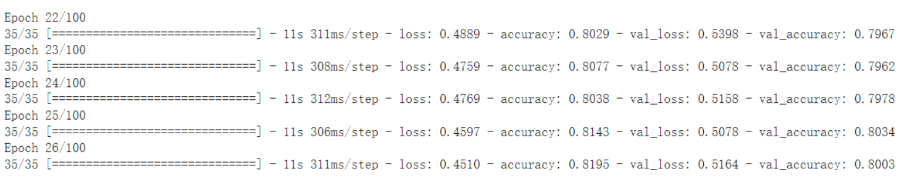

> the Adult (A) dataset (https://archive.ics.uci.edu/ml/datasets/Adult) from UCI (http://archive.ics.uci.edu/ml/), and the Spooky Author Identification (SAI) dataset from Kaggle (https://www.kaggle.com/c/spooky-author-identification).

## 1 Spooky Author

The original data file "train.csv" contains 19578 records. As shown in the figure below, the file contains id, text, and author, where text is the sentence content and author is the abbreviation of the author's name. Text and author are the primary data sources for analysis in this task.

We need to use known data to do deep learning to determine which author the text content belongs to. Two models will be used in this assignment for comparison: the first is DNN, and the second is RNN.

### Model 1 (DNN):

### Data Preprocessing

Since the model cannot directly read text, it is necessary to convert the text into numerical vectors. In this case, global vectors (gloVe) are used for preprocessing to convert the text into numerical vectors.

In this model, three fully connected layers are used, with the first two layers having 300 neurons each. The last layer is the output layer, with three possible outputs corresponding to the three authors: "EAP", "HPL", and "MWS".

### DNN
Here, 100 epochs are set, but early stopping is also set, which stops at the 9th epoch. From the figure below, we can see that the score does not change much after the 9th epoch, and the accuracy is approximately between 0.73 to 0.74.

**The overall average loss is 0.6556, and the accuracy is 0.7431.**

### Model 2 (RNN)

### Data Preprocessing

In this model, two methods are used: LSTM and GRU, both of which are types of RNNs. GRU is a variant of the LSTM method. The data is preprocessed by tokenizing the text and padding the sequences to the same length, which is set to 70.

#### LSTM:

In this model, the hidden feature is set to 100, and the first layer is an LSTM layer, followed by three fully connected layers with 1024 neurons each.

Here, 100 epochs are set, but early stopping is also set, which stops at the 26th epoch. From the figure below, we can see that the score does not change much after the 26th epoch, and the accuracy is approximately between 0.79 to 0.80.

The overall average loss is 0.5164, and the accuracy is 0.8003.

### GRU:

In this model, the hidden feature is set to 300, and the first layer is a GRU layer, followed by three fully connected layers with 1024 neurons each. The architecture is shown in the figure below.
In this model, 100 epochs were set, and early stopping was also used, stopping at the 28th epoch. From the graph below, we can see that the score remains almost unchanged after the 28th epoch, with accuracy falling around 0.77~0.81. Overall, the average loss is 0.4654, and the accuracy is 0.8151.

### Conclusion for  Spooky Author :

- DNN: loss=0.6556, accuracy=0.7431
- RNN:
	- LSTM: loss=0.5164, accuracy=0.8003
	- GRU: loss=0.4654, accuracy=0.8151

Compared to DNN, the loss is the highest and the accuracy is the least accurate. Among the RNN models, GRU has the lowest loss, the highest accuracy, and the best performance. The RNN approach adds an extra layer to the DNN architecture, leading to better results.

------------

## 2 Adult Dataset
We need to use known data to perform Deep Learning to determine whether the salary is >=50k or <50k. This assignment requires using two models for comparison: the first is DNN, and the second is CNN. The detailed feature value settings have been described in the above dataset, and the difference lies only in the numerical settings. Therefore, I will not elaborate on it here, and only write out the accuracies obtained.

### Data preprocessing:

First, delete the rows containing null data from the dataset.
We then divide the dataset into training set, validation set, and testing set.
Use one-hot encoding to convert columns into numerical values based on categories.
Process one-hot encoding and standard scaler sequentially using a pipeline.

### Model 1 (DNN):
First, we used a DNN with 3 hidden layers and ReLU activation function. We used early stop, so we stopped training after 10 epochs, as the accuracy had stabilized and did not improve much after the 10th epoch. At this point, the accuracy was only 0.85.

So we modified the DNN by increasing the number of hidden layers to 4 to see if there would be any improvement. However, the final result showed that the accuracy remained at 0.85, and there was no significant improvement.

### Model 2 (CNN):
First, we need to reshape the data shape to be suitable for use in the 1D Conv layer. We used early stop and stopped training after 19 epochs. At this point, the accuracy was 0.86.

### Conclusion for the Adult Dataset:

CNN is 1% more accurate than DNN.
Whether using a 3 or 4 hidden layer DNN, the accuracy remains at 0.85, and there is not much difference in results for the Adult Dataset.

------------

## Summary of Two Datasets
Two different methods were used in the Spooky Author dataset, DNN and RNN. The precision of DNN was 0.74, while the precision of RNN achieved approximately 0.80 and 0.82 in LSTM and GRU, respectively. RNN's method adds a layer on top of DNN's architecture, resulting in better analysis.

In the Adult dataset, two methods were used, DNN and CNN. Regardless of whether DNN had 3 or 4 hidden layers, the result was about 0.85. The precision of CNN was 0.86, and it was more precise than DNN in analyzing this dataset.

Comparing the two datasets, the precision of DNN and CNN in the Adult dataset was quite similar, while RNN was more accurate than DNN in the Spooky Author dataset. Therefore, the key takeaway from this task is that the number of layers is not significantly correlated with the analysis precision, but it is essential to find the appropriate method for each dataset to obtain the best result.
