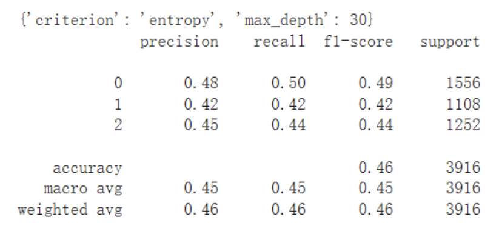

> Let us analyze two datasets: the Adult (A) dataset (https://archive.ics.uci.edu/ml/datasets/Adult) from UCI (http://archive.ics.uci.edu/ml/), and the Spooky Author Identification (SAI) dataset from Kaggle (https://www.kaggle.com/c/spooky-author-identification).

## I. Spooky Author Dataset
### Data preprocessing:
For the Spooky Author Dataset, we will utilize the textual content to determine the authorship of three writers. See the figure below:"

There are 19579 rows in total. Firstly, we need to delete the 'id' column since we don't need this information for our calculations. Next, we remove the unnecessary stop words and punctuation marks, and set the number of features to 300.

Since we need to convert text into vectors, we replace the names of the three authors with 0, 1, and 2 respectively, and then use GloVe to convert the textual content in the 'text' column into vector numbers. At this point, we have 15663 rows of vectors, with each vector representing a sentence and possessing 300 features.

### Method 1: Decision Tree
After calculating the result, the accuracy was found to be 0.46.

Hyperparameter tuning was used to find different model hyperparameters to see if different combinations would have an effect on the final result. Due to the large size of this dataset, a limited number of combinations were selected, including 'criterion' and 'max_depth'. GridSearchCV was used to select the best parameter combination, but the accuracy obtained was still only 0.46, as shown in the figure below.

The accuracy obtained using Decision Tree was only 0.46, even with the use of hyperparameters. This phenomenon is reasonable and indicates that decision trees are not suitable for datasets with a large number of features.

### Method 2: SVM
After calculating the result, the accuracy was found to be 0.72. Cross-validation was used, with cv set to five parts, and the accuracy obtained was still 0.72. Compared to decision tree, SVM has a much higher accuracy, but SVM runs too slow to use hyperparameter tuning to find the best parameters.

