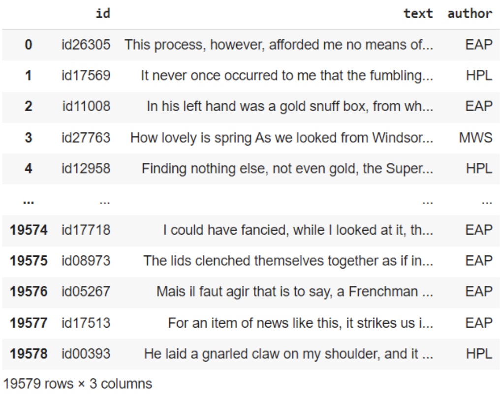
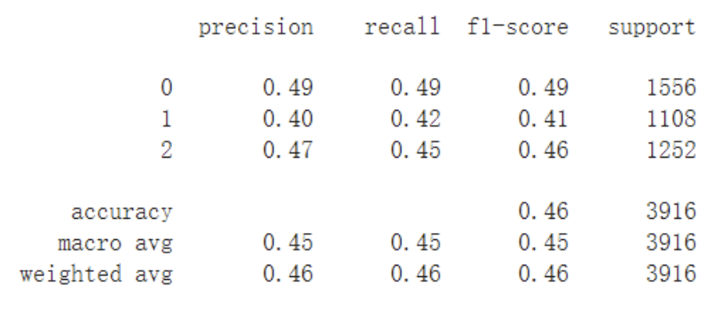
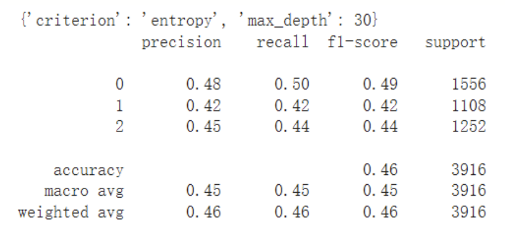
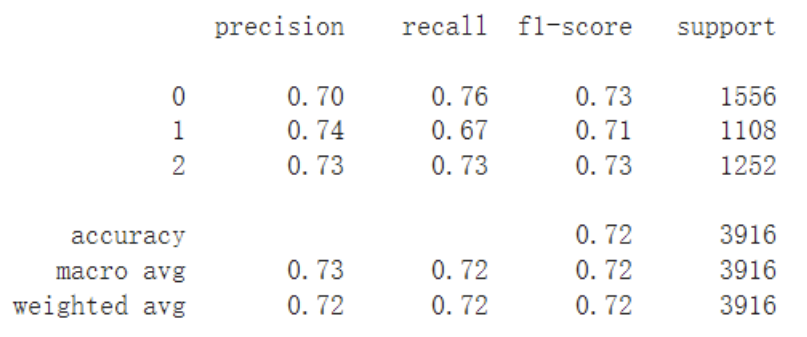
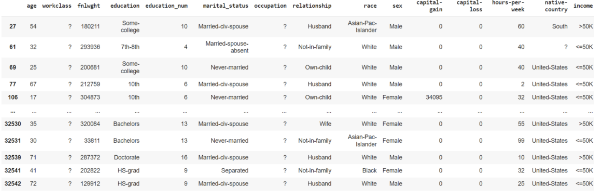
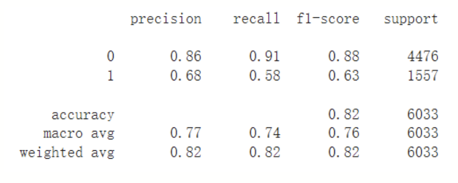
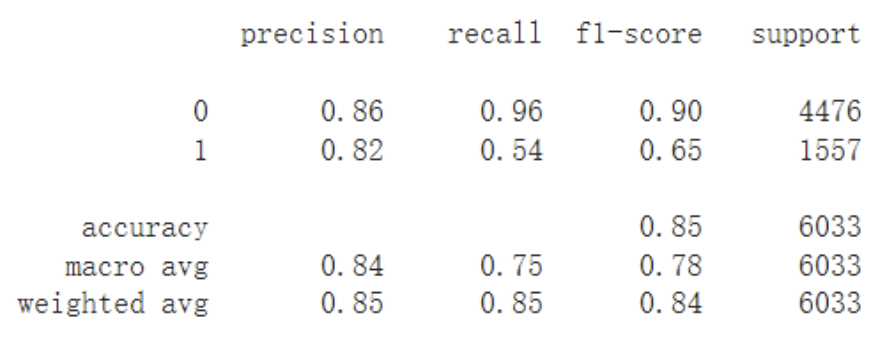
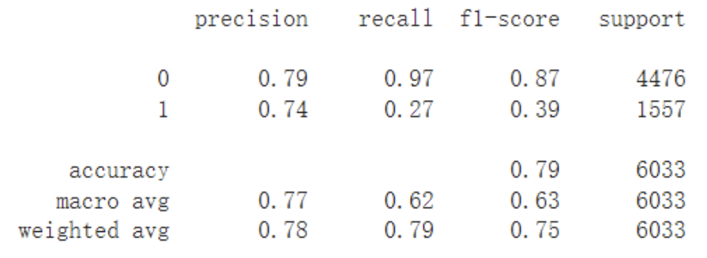
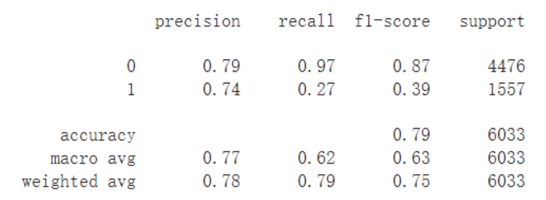
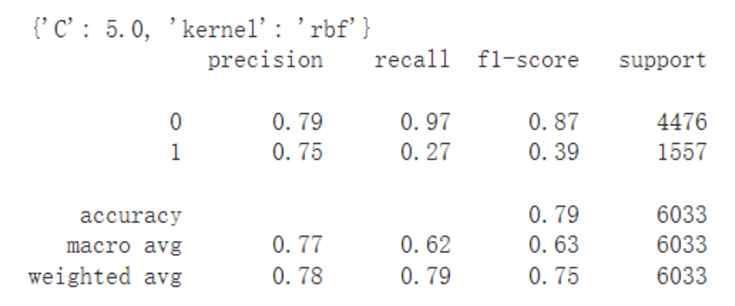

> the Adult (A) dataset (https://archive.ics.uci.edu/ml/datasets/Adult) from UCI (http://archive.ics.uci.edu/ml/), and the Spooky Author Identification (SAI) dataset from Kaggle (https://www.kaggle.com/c/spooky-author-identification).

## I. Spooky Author Dataset
### Data preprocessing:
For the Spooky Author Dataset, we will utilize the textual content to determine the authorship of three writers. See the figure below:"

There are 19579 rows in total. Firstly, we need to delete the 'id' column since we don't need this information for our calculations. Next, we remove the unnecessary stop words and punctuation marks, and set the number of features to 300.

Since we need to convert text into vectors, we replace the names of the three authors with 0, 1, and 2 respectively, and then use GloVe to convert the textual content in the 'text' column into vector numbers. At this point, we have 15663 rows of vectors, with each vector representing a sentence and possessing 300 features.

### Method 1: Decision Tree
After calculating the result, the accuracy was found to be 0.46.

Hyperparameter tuning was used to find different model hyperparameters to see if different combinations would have an effect on the final result. Due to the large size of this dataset, a limited number of combinations were selected, including 'criterion' and 'max_depth'. GridSearchCV was used to select the best parameter combination, but the accuracy obtained was still only 0.46, as shown in the figure below.

The accuracy obtained using Decision Tree was only 0.46, even with the use of hyperparameters. This phenomenon is reasonable and indicates that decision trees are not suitable for datasets with a large number of features.

### Method 2: SVM
After calculating the result, the accuracy was found to be 0.72. Cross-validation was used, with cv set to five parts, and the accuracy obtained was still 0.72. Compared to decision tree, SVM has a much higher accuracy, but SVM runs too slow to use hyperparameter tuning to find the best parameters.

## II. Adult Dataset
### Data Preprocessing:
We will use the Adult Dataset to train and predict the income of each person, whether it is greater than or equal to 50k or less than 50k. The structure of the dataset contains many unknown information as shown in the figure below.

Firstly, we need to remove the rows or columns with unknown information "?", delete the irrelevant column "fnlwght", and finally have 14 remaining rows.

Next, we convert the gender "sex" to a number 0 or 1, and "income>=50" & "income<50K" to numbers 0 or 1 for later training. Using one-hot encoding, we convert the remaining categories into numbers, resulting in a total of 96 features.

### Method 1: Decision Tree
The accuracy of the calculation result is 0.81.

Using Pearson Correlation for feature selection, unnecessary features are eliminated, reducing the number of features from the original 94 to 22. The calculated accuracy is 0.82.

We will use GridSearchCV for Hyperparameter tuning, using the data before feature selection. The calculated accuracy is improved to 0.85.

### Method 2: SVM

The accuracy calculated using SVM is 0.79.

Using feature selection, the accuracy obtained using SVM is still 0.79. 

The accuracy remains at 0.79 even after hyperparameter tuning. 

We found that even with feature selection and hyperparameter tuning, SVM did not show significant improvement in accuracy.

## III. Conclusion

Both datasets were analyzed using decision tree and SVM. It was found that the SVM accuracy for the Spooky Author dataset was 72%, which was more effective than the decision tree accuracy of 46%. On the other hand, the decision tree accuracy for the Adult dataset was 85%, which was higher than the 79% accuracy of SVM. However, the SVM results for both datasets exceeded 70%, indicating that the performance of SVM may not be too bad for both datasets.

From this assignment, we can conclude that for different types of datasets, adjustments need to be made accordingly, and different methods can be used to achieve accuracy. Finally, there will be a most suitable way to train the model!

